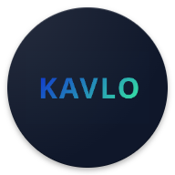
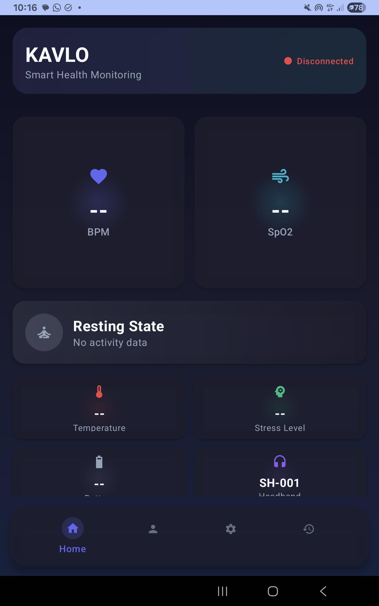
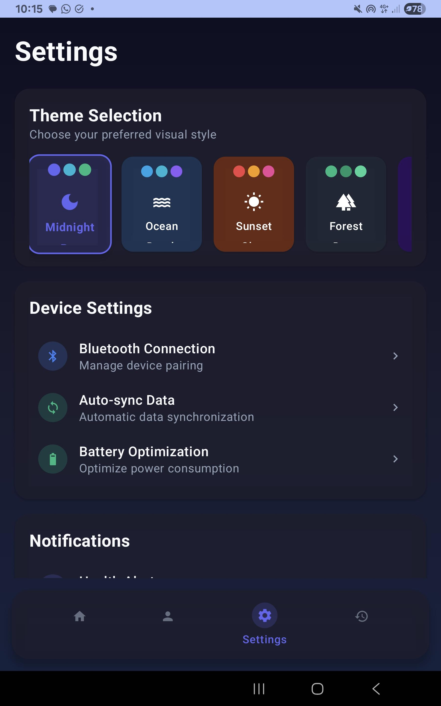
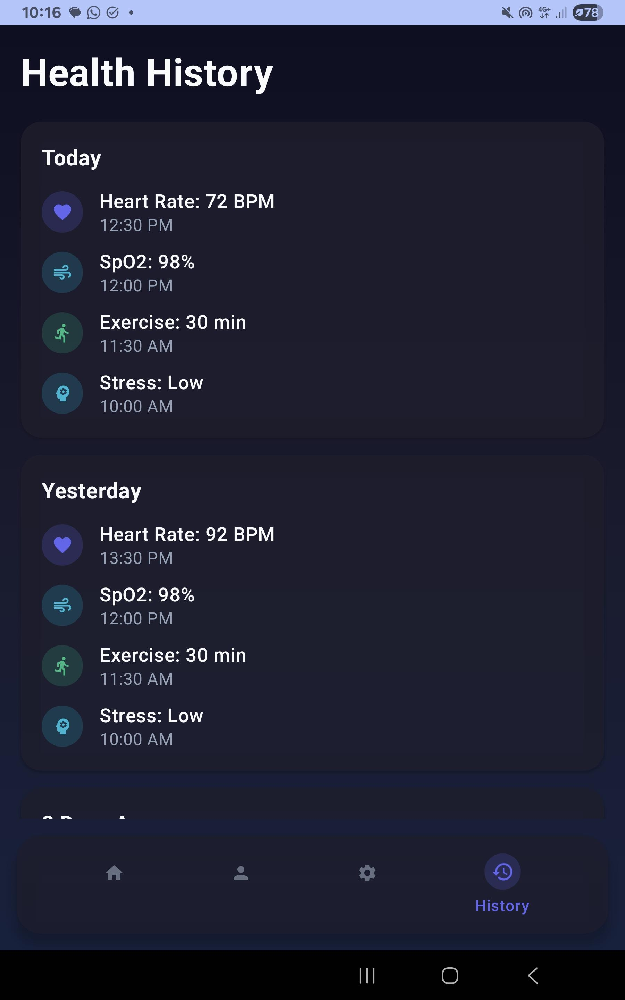

# KAVLO Smart Headband

<p align="center">
  
</p>

## 🎯 About
KAVLO Smart Headband is an innovative solution developed for Samsung Solve for Tomorrow 2025. This project combines IoT and AI technology to monitor user fatigue levels through a smart headband device, providing real-time health insights and actionable recommendations.

## ✨ Features
- 📱 **Modern UI with Jetpack Compose**
  - Intuitive dashboard
  - Real-time sensor data display
  - Activity history
  - Theme customization

- 🔍 **Health Monitoring**
  - Heart Rate
  - SpO2 Level
  - Temperature
  - Stress Level
  - AI-powered Fatigue Analysis

- 🤖 **AI Integration**
  - TensorFlow Lite implementation
  - Real-time fatigue detection
  - Fatigue level prediction
  - Smart alerts & notifications

- 📡 **Connectivity**
  - Bluetooth Low Energy
  - Auto-reconnect capability
  - Optimized data transfer
  - Real-time synchronization

## 🎥 Demo Video

[](https://youtu.be/mazTvVSI3dM)

Or click this link: [https://youtu.be/mazTvVSI3dM](https://youtu.be/mazTvVSI3dM)

## 🛠 Tech Stack
- **Frontend**: Kotlin, Jetpack Compose
- **AI/ML**: TensorFlow Lite
- **IoT**: ESP32, Bluetooth LE
- **Sensors**: Heart rate, SpO2, Temperature

## 📱 Screenshots
<p align="center">
  
  
  
</p>

## 📋 Prerequisites
- Android Studio Arctic Fox or newer
- Android SDK 21+
- Kotlin 1.5+
- ESP32 Development Board
- KALMA Smart Headband Hardware

## 🚀 Getting Started
1. Clone the repository:
```bash
git clone https://github.com/LixUb/All-In-One.git
```

2. Open project in Android Studio

3. Sync gradle dependencies

4. Run on device or emulator

## 📖 Documentation
Complete documentation can be found in our [Wiki](https://github.com/LixUb/All-In-One/wiki)

## 🤝 Contributing
Contributions are always welcome! Please read [CONTRIBUTING.md](CONTRIBUTING.md) for details.

## 📄 License
This project is licensed under the MIT License - see the [LICENSE](LICENSE) file for details.

## 👥 Team
- Backend & IoT Developer - [Rayhan Nulhafiz](https://github.com/LixUb)
- UI/UX Designer - [Senna Farras Hazim](https://github.com/GeneralFrosa)
- Concept Paper - [Abdurahman Yusuf](https://github.com/Abduudu)
- ML Engineer - [Muhammad Rifqi Athaullah](https://github.com/Ripslinger9)

## 🙏 Acknowledgments
- [Samsung Solve for Tomorrow 2025](https://www.samsung.com/id/solvefortomorrow/)
- [TensorFlow](https://www.tensorflow.org/)
- [Android Jetpack](https://developer.android.com/jetpack)
- [ESP32](https://www.espressif.com/)

---
<p align="center">Made with ❤️ by KALMA Team</p>
